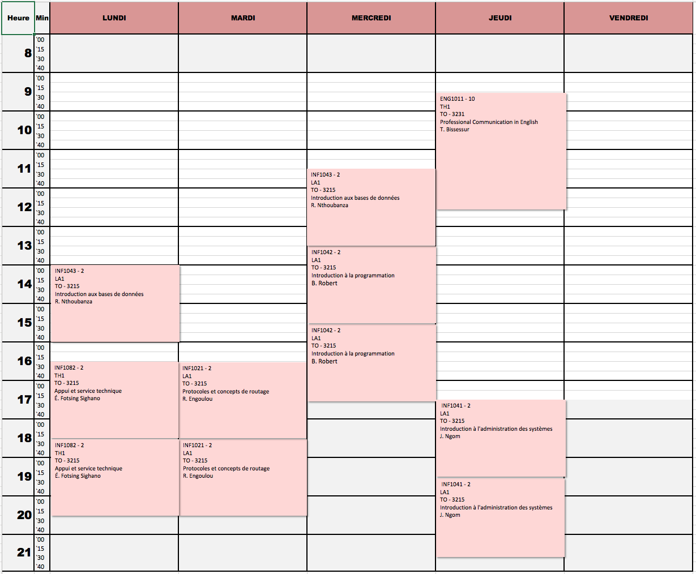
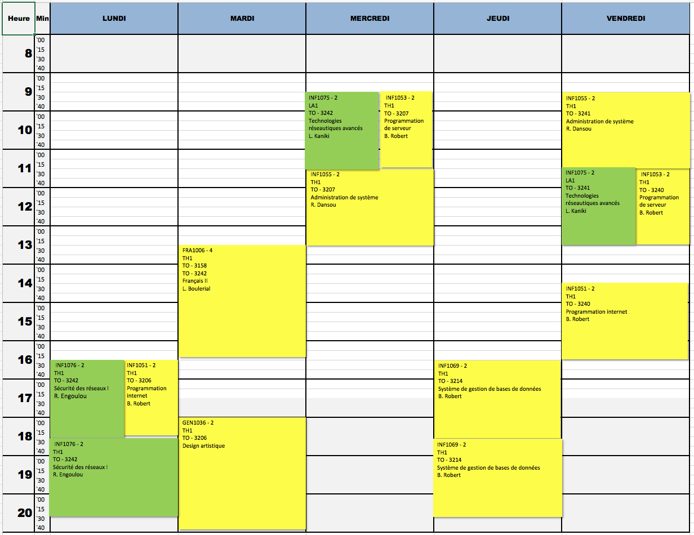

# Hiver 2019

# Calendrier GINF

# Calendrier GINQ

## ÉTAPE 2

|     Code	                                                 | Titre du cours                               | Commentaires            |
|:---------------------------------------------------------------|:-------------------------------------------- |:------------------------|
| [INF1021](https://github.com/CollegeBoreal/INF1021-201-19H-02) | Protocoles et concepts de routage            |                         |
| [INF1041](https://github.com/CollegeBoreal/INF1041-201-19H-02) | Introduction à l'administration des systèmes |                         |
| [INF1042](https://github.com/CollegeBoreal/INF1042-201-19H-02) | Introduction à la programmation              |                         |

## ÉTAPE 4

|    Cours                                                       | Intitulé                                     |  Commentaires           |
|:--------------------------------------------------------------:|:---------------------------------------------|:------------------------| 
| [INF1051](https://github.com/CollegeBoreal/INF1051-201-19H-02) | Programmation internet                       |                         |
| [INF1053](https://github.com/CollegeBoreal/INF1053-201-19H-02) | Programmation de serveur                     |                         |
| [INF1055](https://github.com/CollegeBoreal/INF1055-201-19H-02) | Administration de système                    |                         |
| [INF1069](https://github.com/CollegeBoreal/INF1069-201-19H-02) | Design de bases de données                   |                         |

